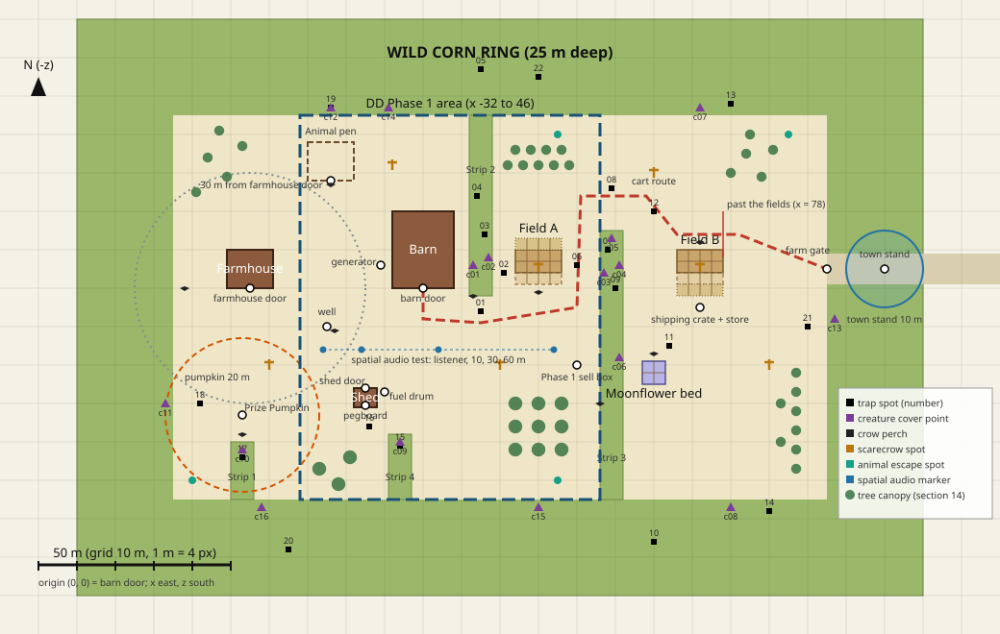

# Doc 04: Farm Layout

Owner: Level Designer. Task: PP-05. Status: done (QA passed on re-review, Director checked against doc 01,
2026-10-07).

Where everything on the farm stands, in metres, so that "every errand crosses its ground" (doc 01
"The Creature"). Doc 01 is the source of truth; every rule here cites the doc 01 section it comes
from. **Numbers doc 01 doesn't give are marked `placeholder`** and are tuned in the DD Phase 1 and 2
playtests. Inference is marked as inference, with what would settle it. Walking speed, can
refills and plots per player come from doc 02 section 2 (all `placeholder` there). The placements
the Director settled (the generator's place, the DD Phase 1 sell box, the marker group names) are
D-016. Every distance here was computed from the coordinates in sections 3 to 7, not measured off
the diagram.

## Contents

1. [Conventions](#1-conventions)
2. [Diagram](#2-diagram)
3. [Ground: the clearing, the corn ring and the strips](#3-ground-the-clearing-the-corn-ring-and-the-strips)
4. [Buildings and fixed props](#4-buildings-and-fixed-props)
5. [Fields, moonflower bed and Prize Pumpkin](#5-fields-moonflower-bed-and-prize-pumpkin)
6. [Cart route, farm gate and town stand](#6-cart-route-farm-gate-and-town-stand)
7. [Markers for other roles](#7-markers-for-other-roles)
8. [Distance checks](#8-distance-checks)
9. [The DD Phase 1 layout](#9-the-dd-phase-1-layout)
10. [Doc 01 elements checklist](#10-doc-01-elements-checklist)
11. [Gotchas](#11-gotchas)
12. [Questions raised](#12-questions-raised)

## 1. Conventions

- **1 unit = 1 metre, Y up** (CONTRACTS section 4). Coordinates here are `(x, z)` on the ground
  plane: **x east, z south**, so north is -z, Godot's forward. Ground is flat at y = 0
  (`placeholder`; flat ground keeps the distance checks exact).
- **Origin `(0, 0)` is the barn door's outer threshold.** Building positions are their door
  thresholds (CONTRACTS section 4, D-007), so "30 m from any building's door" is a distance between
  the points in section 4.
- Rectangles are written `x0..x1, z0..z1`.
- Corn is 2.4 m tall and blocks sight both ways (CONTRACTS section 4, doc 01 "Senses > Sight").
- Distances are straight lines unless the table says "walk", which follows open ground around corn
  and fields (section 8.7).

## 2. Diagram

[04_farm_layout.svg](04_farm_layout.svg): 1 m = 4 px, grid lines every 10 m, scale bar 50 m, north
up. Every shape in it has its coordinates in sections 3 to 7, so it can be checked by hand: an
`(x, z)` point is drawn at `((x + 110) × 4, (z + 75) × 4)` px.

| Mark | Meaning |
|---|---|
| Green | Corn (ring and strips) |
| Brown blocks | Buildings; white circle with black outline = a door or fixed prop |
| Tan grid, dashed lower row | Field plots; the dashed row is the upgrade row |
| Purple squares | Moonflower bed |
| Red dashed line | Cart route |
| Orange dashed circle | 20 m around the Prize Pumpkin; grey dotted circle = 30 m from the farmhouse door |
| Blue circle | Town stand sanctuary, 10 m |
| Blue dashed outline | DD Phase 1 area |
| Black squares (numbered) | Trap spots |
| Purple triangles (`cNN`) | Creature cover points |
| Dark wings | Crow perches |
| Orange crosses | Scarecrow spots |
| Teal circles | Animal escape spots |
| Small blue dots | Spatial audio test markers |

## 3. Ground: the clearing, the corn ring and the strips

Doc 01 "The Creature": the creature "lives in the wild corn ringing the farm. Players can't cut or
farm that corn. Strips of it reach toward the buildings and stand between the barn and both fields."

| Area | Rectangle | Notes |
|---|---|---|
| Clearing (open ground) | x -65..105, z -45..55 (170 × 100 m) | `placeholder` size, set by the distances in section 8 |
| Wild corn ring | x -90..130, z -70..80, minus the clearing | 25 m deep (`placeholder`); deep enough for doc 03's "deep in the corn" (section 7.1) |
| Road lane through the ring | x 105..150, z -9..-1 (8 m wide) | From the farm gate east to the town and out of the map |
| Strip 1 (farmhouse) | x -50..-44, z 40..55 | Reaches north from the south ring toward the farmhouse door; the "first corn strip" of the Prize Pumpkin rule (section 5.3) |
| Strip 2 (barn) | x 12..18, z -45..2 | Reaches south from the north ring past the barn's east wall (4 m away); stands between the barn and both fields |
| Strip 3 (fields) | x 46..52, z -15..55 | Reaches north from the south ring; stands between field A and field B, and with strip 2 between the barn and field B |
| Strip 4 (shed) | x -9..-3, z 38..55 | Reaches north from the south ring toward the shed and fuel drum |

- **Strips are 6 m wide** (`placeholder`), so nowhere in a strip is more than 3 m from open ground.
  Being "deep in the corn" (doc 01 "Day deaths") is therefore only possible in the ring unless
  doc 03 sets "deep" at 3 m or less (inference; settled by doc 03's number).
- **Strips 2 and 3 alternate sides** (north, then south), so the walk from the barn to field B
  weaves round two tips and passes within 3 to 4 m of corn twice.
- A map boundary sits at the ring's outer edge (inference: doc 01 doesn't say what lies beyond the
  ring; an invisible wall inside dense corn is the cheapest; the gray-box task settles it).

## 4. Buildings and fixed props

Footprints are `placeholder` gray-box sizes. Door facing is the direction a player faces walking
out.

| Element | Door or position | Footprint | Facing | Doc 01 source |
|---|---|---|---|---|
| Barn | (0, 0) | x -8..8, z -20..0 | south | "Light is the rule"; "The Harvest Moon" (cart loaded in the lit barn); lobby is "the dark barn at night" ("Recording lines") |
| Farmhouse | (-45, 0) | x -51..-39, z -10..0 | south | "Generator" (lights barn and farmhouse); porch light at the door ("Ghosts > Lantern flicker") |
| Tool shed | (-15, 26) | x -18..-12, z 26..31 | north | "The tool shed"; lock on the door |
| Pegboard | (-15, 30.5), inside on the back wall | | faces the door | "The tool shed > Pegboard" |
| Generator | (-11, -6), 3 m off the barn's west wall | 2 × 1 m | | "Nights > Generator"; "From day 6 ... bangs the barn doors while circling to the generator" ("Light is the rule") |
| Fuel drum | (-10, 27), beside the shed door | 1 m | | "the drum by the shed is free and infinite; the walk is the cost" ("Nights") |
| Well | (-25, 10) | 2 m | | "Taint > Cure", "Senses > Hearing" (well pump) |
| Shipping crate and store | (72, 5) | 2 × 1 m | | "Crops" (field B "by the shipping crate"), "Store" ("Bought by the shipping crate") |
| Town stand | (120, -5) | 3 × 2 m | | "Core Loop" (sell at the town stand), "AI Director > Sanctuary" |
| Farm gate | (105, -5), in the clearing's east fence | 6 m wide | | "Nights > Length", "Winning and losing" |
| Animal pen | x -30..-18, z -38..-28; gate (-24, -28) | 12 × 10 m, fenced | | "Daytime Threats > Broken fences", "Roles > Rancher" |

- **The generator is not by the shed** (D-016). Doc 01 "Nights" puts only the drum there and says
  "the walk is the cost". The generator sits by the barn it powers, 33 m from the drum, so a refuel
  is a 66 m round trip past strip 4's tip at night.
- **Respawn and lobby:** players spawn at dawn inside the barn (inference: doc 01 says the dead
  "respawn at the next dawn" without a place; the barn is the lobby and the cart's start).
- **Lit doorway light:** a lit door's light reaches 6 m (`placeholder`, doc 07 sets it). It matters
  for pumpkin guarding (section 8.5).
- **Church bell:** heard, not visited. Its sound plays from (400, -5), beyond the town end of the
  road (`placeholder`; doc 08 owns the sound, doc 01 "Core Loop > Dusk").

## 5. Fields, moonflower bed and Prize Pumpkin

### 5.1 Fields

Doc 01 "Crops": "16 field plots at the start, up to 24 with upgrades, split into two distant fields
(one by the barn, one by the shipping crate) with corn between them."

| Field | Rectangle | Starting plots | Upgrade plots | Near |
|---|---|---|---|---|
| Field A | x 24..36, z -10..-1 | 8: rows z -10..-4 | 4: row z -4..-1 | Barn door 30.5 m (centre), 24 m (nearest corner) |
| Field B | x 66..78, z -10..-1 | 8: rows z -10..-4 | 4: row z -4..-1 | Shipping crate 10.5 m (centre) |

- **Plots are 3 × 3 m** (`placeholder`), 4 columns by 3 rows per field, so 8 + 8 = 16 at the start
  and 12 + 12 = 24 at most (doc 01 "Crops"). Upgrades fill the south row of each field; the bank's
  seizure of 2 plots ("Foreclosure Notice") takes from that row first (inference; doc 02 settles
  which plots).
- Field centres are 42 m apart in a straight line, 48 m on foot round strip 3 (section 8.7).
- Fields are walkable: plots are bare ground, so walks may cross them.
- **Plots per player:** doc 01 "Crops > Labor" gives a starting estimate of about 6, so 4 players
  tend all 24. Doc 02 section 2.4 derives about 9 to 11 from this layout's walks with its
  `placeholder` holds and speeds. Which knob moves (holds, capacities or a longer layout) is Q-015
  item 4, left to the simulator by the Director; the layout stays until then.

### 5.2 Moonflower bed

Doc 01 "Crops > Moonflower bed": 1 plot per player; "moonflowers pay most but mean dark, far walks"
("Farming Meets Horror").

- x 57..63, z 19..25: 2 × 2 plots of 3 m (4 plots for 4 players; fewer players leave plots unused,
  per doc 01 "Debt formula" step 5, "the moonflower bed ... follow[s] headcount").
- East of strip 3, 5 m from its edge. Barn door 63.9 m in a straight line but 98 m on foot round
  strip 3's tip, the farm's darkest walk; field B 30 m.
- The glow (doc 01 "Crops") is the only light there, so the bed is a landmark at night from the
  route north of strip 3 and from field B.

### 5.3 Prize Pumpkin patch

Doc 01 "The Prize Pumpkin > Placement": "at least 30 m from any building's door, between the
farmhouse and the first corn strip."

- Patch centre **(-47, 33)**, 4 m across (`placeholder`).
- Doors: farmhouse 33.1 m, shed 32.8 m, barn 57.4 m, all ≥ 30 m.
- "First corn strip" is read as the strip nearest the farmhouse, strip 1, whose tip (-47, 40) is
  7 m south of the patch; the farmhouse door is 33 m north. So the patch lies on the line from the
  farmhouse door to strip 1 (inference: doc 01 doesn't number the strips; the Director's check
  confirms the reading).
- Harvest Moon: it is moved to the barn at dusk, a 57 m straight-line trip (doc 01 "The Harvest
  Moon"; how it moves is doc 02's and doc 05's).

## 6. Cart route, farm gate and town stand

### 6.1 Cart route

Doc 01 "The Harvest Moon": the cart is loaded in the barn and pushed to the gate; "At the cap, the
cart counts as out only if it's past the fields" ("Nights > Length").

| Waypoint | (x, z) | Leg length | Least distance to corn on the leg |
|---|---|---|---|
| R0 barn door | (0, 0) | | 12.0 |
| R1 | (0, 8) | 8.0 | 12.0 |
| R2 south of strip 2's tip | (15, 9) | 15.0 | 6.8 |
| R3 east of field A | (40, 5) | 25.3 | 6.0 |
| R4 north, between field A and strip 3 | (41, -24) | 29.0 | 5.3 |
| R5 north of strip 3's tip | (58, -24) | 17.0 | 9.0 |
| R6 | (66, -14) | 12.8 | 10.3 |
| R7 north of field B | (82, -14) | 16.0 | 14.0 |
| R8 farm gate | (105, -5) | 24.7 | 3.7 |

- **Length 147.9 m.** It weaves round both strip tips, so the creature has cover within 5 to 7 m of
  the cart on the R2 to R5 legs.
- **The gate is a corn pinch.** The gate opens into the 8 m road lane, so on the last metres of
  R7 to R8 the cart passes 3.7 m from the ring's corn, and 4 m from it on both sides at the gate.
  That is the route's closest pass to corn, at the end. The layout keeps it on purpose: the gate run
  is "a guaranteed peak, then release as the cart rolls out" (doc 01 "The Harvest Moon"), and a
  pinch at the gate gives the creature a place to make that peak (inference; the DD Phase 4 Harvest
  Moon playtest settles whether it is too hard).
- **"Past the fields" is x > 78**, field B's east edge (inference: the line beyond which both fields
  are behind the cart; doc 05 makes it a check on the cart's position).
- Cart speed by pusher count is doc 02's or doc 03's, so the push time is not given here.
- The route keeps ≥ 4 m from every field edge (R3 to R4 passes 4 m east of field A).
- Player-placed fences and scarecrows ("Farming Meets Horror > Defense") could block it; the host
  should refuse placements within 3 m of the route (inference; doc 05 settles the rule, Q-014 item
  6). Settled: doc 05 sections 11 and 13 adopt 3 m (reason `blocks_cart_route`).
- **Scene contract (Q-022, Q-026).** The route is a `Path3D` named `CartRoute` in the level scene, with
  curve points R0 to R8 in order, y = 0, coordinates as in the table. DD Phase 1 gray-box scene:
  `res://game/world/farm_phase1.tscn` (one field, shed, barn); DD Phase 2: `res://game/world/farm.tscn`.
  Phase 1 has no cart, so `CartRoute` first exists in `farm.tscn`.
- **Light and corn nodes (Q-026).** A `LightRig` scene sits at each door and window of every building;
  lit doorway radius, ground decal and the doc 03 section 9 trap exclusion are all 6 m (doc 07
  section 3). Layer 5 corn sight-blockers are coarse `StaticBody3D` edge strips under a `CornBlockers`
  node, separate from the visual MultiMesh corn (doc 07 section 10); blocker bounds follow the ring
  and strip edges in section 3.

### 6.2 Farm gate and town stand

- **Farm gate (105, -5)**, in the east fence at the clearing's edge. The road runs east from it
  through the ring in an 8 m lane.
- **Town stand (120, -5)**, 15 m outside the gate beside the road, with corn on both sides of the
  lane. Its **10 m sanctuary** (doc 01 "AI Director > Sanctuary") covers x 110..130 of the lane.
  - It never reaches the gate (5 m clear) or any of the cart route (nearest point 15 m), so the
    gate run is never safe ground.
  - It contains no plot, so "nothing grows there" costs nothing that the layout offers.
  - Corn stands within the circle, so the creature can be near a player there but can't act (doc
    01: no lures, scares or kills).
- **Selling and the store are in different places** (D-017): the shipping crate is the store only;
  selling is at the town stand and at the dawn cash-in.
- Field B to the stand is 48 m on foot; the barn door 127.5 m (section 8.7).

## 7. Markers for other roles

The gray-box farm places these as named `Marker3D` nodes at y = 0, in the groups D-016 accepted
(they enter CONTRACTS when the gray box starts): `trap_spots`, `creature_cover`, `crow_perches`,
`scarecrow_spots`, `animal_escape_spots`, `spatial_audio_markers`. Counts, and the distance
thresholds that define each kind below, are `placeholder`; doc 03 decides which spots are used
each night.

### 7.1 Trap spots

Doc 01 "Night Traps": traps sit in "rows" with clues; day 6 at 4 players is the most at once, 5
bear, 3 pits and 2 bells (doc 01 "Ramp-up"), so 22 spots (`placeholder`, twice the night's maximum
plus two) let placement vary. Kinds (thresholds `placeholder`): **edge** = open ground within
12 m of corn on a walked line; **row** = 2 to 3 m inside corn; **deep** = 10 m or more inside the
ring, for the trap race's "a trap deep in the corn" (doc 01 "Day deaths"). Bells go on row spots
("strung low across rows"). "Inside" is the distance to the nearest open ground.

| Spot | (x, z) | Kind | Where |
|---|---|---|---|
| trap_01 | (15, 6) | edge | Strip 2's tip, barn to field A walk |
| trap_02 | (21, -4) | edge | Field A's west side, 3 m from strip 2 |
| trap_03 | (16, -14) | row | Strip 2 |
| trap_04 | (14, -24) | row | Strip 2, behind the barn |
| trap_05 | (15, -57) | deep | North ring, 12 m in |
| trap_06 | (40, -6) | edge | Between field A and strip 3 (on the cart route) |
| trap_07 | (48, -10) | row | Strip 3's tip |
| trap_08 | (49, -26) | edge | North of strip 3's tip, field A to B walk |
| trap_09 | (50, 0) | row | Strip 3, between the fields |
| trap_10 | (60, 66) | deep | South ring behind the moonflower bed, 11 m in |
| trap_11 | (64, 15) | edge | Field B to moonflower walk |
| trap_12 | (60, -20) | edge | North-east of strip 3's tip, 9.4 m from it (cart route R5 to R6) |
| trap_13 | (80, -48) | row | North ring edge by field B |
| trap_14 | (90, 58) | row | South ring edge, east |
| trap_15 | (-6, 41) | row | Strip 4's tip |
| trap_16 | (-14, 36) | edge | Behind the shed, fuel walk |
| trap_17 | (-47, 44) | row | Strip 1, beside the pumpkin |
| trap_18 | (-58, 30) | edge | West of the pumpkin |
| trap_19 | (-24, -47) | row | North ring behind the animal pen |
| trap_20 | (-35, 68) | deep | South ring, 13 m in |
| trap_21 | (100, 10) | edge | By the gate |
| trap_22 | (30, -55) | deep | North ring behind field A, 10 m in |

Stolen tools "often beside an armed trap" and creature leavings (dead crows, strange seeds) use
trap spots and crow perches (inference; doc 03 settles where sabotage drops things).

### 7.2 Creature cover points

Doc 01 "Behavior states": it lures "from cover" and stalks "from cover". Each point is 1 to 2 m
inside corn (`placeholder`), facing a work spot, and doubles as a lure source for "generic voice
lines from the corn" in DD Phase 1 (doc 01 "Build Plan").

| Point | (x, z) | Watches |
|---|---|---|
| cover_01 | (13, -6) | Barn door and field A |
| cover_02 | (17, -8) | Field A |
| cover_03 | (47, -4) | Field A, cart route R3 to R4 |
| cover_04 | (51, -6) | Field B |
| cover_05 | (49, -13) | Strip 3's tip, field A to B walk |
| cover_06 | (51, 18) | Moonflower bed |
| cover_07 | (72, -47) | Field B, cart route |
| cover_08 | (80, 57) | Moonflower bed, shipping crate |
| cover_09 | (-6, 40) | Fuel drum, shed |
| cover_10 | (-47, 42) | Prize Pumpkin |
| cover_11 | (-67, 30) | Prize Pumpkin, farmhouse |
| cover_12 | (-24, -47) | Animal pen |
| cover_13 | (107, 8) | Farm gate |
| cover_14 | (-9, -47) | Barn's north side, generator |
| cover_15 | (30, 57) | Open ground south of field A |
| cover_16 | (-42, 57) | Prize Pumpkin, strip 1 |

### 7.3 Crows, scarecrows, pen and escape spots

- **Crow perches** (doc 01 "Ghosts > The crow", "Jumpscares > Fake-outs"): crow_01 (30, 1) field A
  fence; crow_02 (72, -12) field B fence; crow_03 (13, 2) strip 2's tip; crow_04 (-47, 38) by the
  pumpkin; crow_05 (60, 17) moonflower bed; crow_06 (-24, -27) pen gate; crow_07 (46, 30) strip 3's
  edge; crow_08 (-62, 0) west ring edge; crow_09 (-23, 11) on the well, which is 32 m from corn,
  so ghosts there see the creature only through crows (section 8.4).
- **Scarecrow spots** (doc 01 "Jumpscares > The scarecrow moved", "Store > More scarecrows"):
  scarecrow_01 (30, -5.5) and scarecrow_02 (72, -5.5) are the field scarecrows at the start (2,
  `placeholder`); scarecrow_03 (20, 20), _04 (-40, 20), _05 (60, -30), _06 (90, 20) and _07 (-8,
  -32) are the moved-scarecrow spots, each turned to face the farmhouse door when used. Bought
  scarecrows are placed by players on open ground and need no marker.
- **Animal pen** (section 4) and **escape spots** where escaped animals end up, each 5 m from the
  ring and 60 m or more from the pen gate (both `placeholder`), so animals are "rounded up far from
  the group" (doc 01 "Daytime Threats"): escape_01 (35, -40) 60.2 m, escape_02 (95, -40) 119.6 m,
  escape_03 (35, 50) 97.8 m, escape_04 (-60, 50) 85.9 m. (The first draft had escape_01 at
  (-60, -40), 37.9 m from the gate; it moved north of field A.)
- **Flags** are player-placed anywhere (doc 01 "Night Traps > Flags") and need no marker.

### 7.4 Spatial audio test markers

Doc 01 "Testing > Spatial audio (Phase 1 gate)": place a voice and a whistle at 10, 30 and 60 m.
Proposed test line, all inside the DD Phase 1 area on open ground: listener `audio_listener`
(-26, 16); sources `audio_10m` (-16, 16), `audio_30m` (4, 16), `audio_60m` (34, 16). The sources
stay put and the listener's heading is randomised per trial, so front-to-back confusion is tested
without needing 60 m of open ground in every direction (inference; the procedure is doc 09's).

## 8. Distance checks

### 8.1 Key distances (straight line, m)

| From | To | m |
|---|---|---|
| Barn door | Farmhouse door | 45.0 |
| Barn door | Generator | 12.5 |
| Barn door | Shed door | 30.0 |
| Farmhouse door | Shed door | 39.7 |
| Generator | Fuel drum | 33.0 |
| Barn door | Well | 26.9 |
| Well | Shed door | 18.9 |
| Well | Farmhouse door | 22.4 |
| Barn door | Field A centre | 30.5 |
| Field A centre | Field B centre | 42.0 |
| Barn door | Field B centre | 72.2 |
| Field B centre | Shipping crate | 10.5 |
| Field B centre | Moonflower bed centre | 30.0 |
| Field A centre | Moonflower bed centre | 40.7 |
| Barn door | Moonflower bed centre | 63.9 |
| Farmhouse door | Prize Pumpkin | 33.1 |
| Shed door | Prize Pumpkin | 32.8 |
| Barn door | Prize Pumpkin | 57.4 |
| Well | Prize Pumpkin | 31.8 |
| Field B centre | Town stand | 48.0 |
| Farm gate | Town stand | 15.0 |
| Escape spots | Pen gate | 60.2 to 119.6 (section 7.3) |
| Barn door | Town stand | 120.1 |
| Prize Pumpkin | Town stand | 171.3 (the farm's longest) |

### 8.2 Spatial audio test (10, 30, 60 m)

Doc 01 "Testing" tests placement at 10, 30 and 60 m. Doc 06 section 8 sets voice attenuation at
max distance 80 m (`placeholder`), so beyond 80 m a voice is silent.

| Band | Pairs on this farm | What it means |
|---|---|---|
| About 10 m (up to 11) | Plots within one field (10.8 m at most between plot centres); field B and the crate (10.5) | Tested at 10 m |
| 11 to 30 m | Barn door and generator (12.5); well to shed, farmhouse and barn; barn to shed; field B to moonflowers | Tested at 10 and 30 m |
| 30 to 60 m | Barn to field A (30.5), fields to each other (42), barn to farmhouse (45), pumpkin to barn (57) | Tested at 30 and 60 m |
| 60 to 80 m | Barn to moonflowers (63.9), barn to field B (72.2) | Audible but beyond the tested 60 m |
| Over 80 m | Barn to town stand, pumpkin to the far field, anything to the stand from the yard | Silent: a seller or a guard can't be called by voice from across the farm |

- **Most calls fall inside the tested range, two don't.** Field to field (42 m), barn to field A
  (30.5 m) and yard to pumpkin (57.4 m from the barn door) are at most 60 m. **Barn to field B
  (72.2 m) and barn to the moonflower bed (63.9 m) are not:** audible, but beyond the 60 m the test
  checks. The layout keeps them: the far field and the moonflowers are meant to be far (doc 01
  "Crops": "two distant fields"; "Farming Meets Horror": "dark, far walks"), and moving field B
  within 60 m of the barn would put it within 30 m of field A. Whether players can place a voice at
  72 m is untested (inference; settled by adding a 72 m trial to the DD Phase 2 playtest, doc 09's
  call).
- **Over 80 m is deliberate:** the town stand and the far ends are out of voice range, which is the
  cost of splitting up (doc 01 "Farming Meets Horror > Splitting up"). The whistle "carries far"
  (doc 01 "How players fight back"), so its range should be at least 171 m, the farm's longest
  distance, so it is heard everywhere (inference; doc 08 sets it, Q-014 item 4).
- If the DD Phase 1 test fails at 60 m, the 60 to 80 m pairs fail too; moving the moonflower bed
  and field B 10 m west would bring them under 65 m (an option, not a plan).

### 8.3 The 15 m lure rule

Doc 01 "Who hears a lure": day lures reach a player "only with no teammate within about 15 m".

- **Two players in one field are always within 15 m** (plot centres at most 10.8 m apart), so
  sharing a field protects both from day lures; splitting the fields (42 m apart) exposes both.
- Work spots under 15 m apart: the shed and its drum (5.1 m), field B and the crate (10.5 m), and
  the **barn door and the generator (12.5 m)**. So a teammate at the barn door shields a refueller
  at the generator from day lures, but not at the drum (28.8 m from the barn door). Every other pair
  of work spots is 18.9 m or more apart, so any errand done alone can be lured. (The farm gate and
  the town stand are 15.0 m apart, and the stand's sanctuary blocks lures anyway.)
- A spotter watching a disarm (doc 01 "Night Traps > Spotting") stands within 15 m to block lures,
  and every trap spot has open ground within 15 m to stand on, except the deep spots, which are 10
  to 13 m into the ring (inference: the spotter must enter the corn there).
- Every lure-exposed work spot has corn within 20 m for the lure to come from (section 8.4) except
  the generator (23 m) and the well (32 m); lures there come from the yard's corn edges at range
  (doc 03's lure distance settles whether that's close enough).

### 8.4 The 20 m ghost radius

Doc 01 "Ghosts > Spectating": within about 20 m ghosts see the creature as a smeared silhouette;
beyond that, only through animals and crows. Nearest corn to each work spot:

| Spot | Corn within (m) | Ghost can see the corn edge? |
|---|---|---|
| Prize Pumpkin | 7.0 | Yes |
| Moonflower bed centre | 8.0 | Yes |
| Fuel drum | 11.0 | Yes |
| Barn door, field A centre | 12.0 | Yes |
| Shed door | 13.4 | Yes |
| Animal pen gate | 17.0 | Yes |
| Farmhouse door, field B centre, shipping crate | 20.0 | At the limit (field B's west edge is 14 m from strip 3, its nearest plot centre 15.5 m) |
| Farm gate | 4.0 | Yes (the lane's corn) |
| Generator | 23.0 | No: the pen's animals and crow_06, 25 m away, react for it |
| Well | 32.2 | No: crow_09 sits on the well |

### 8.5 The 20 m pumpkin radius and the 30 m door rule

Doc 01 "The Prize Pumpkin": a guard "outdoors within 20 m for at least 60 seconds"; "Time inside a
lit doorway's light doesn't count"; gnawed "on any night nobody is within 20 m".

- The nearest door is 32.8 m away, so the nearest lit-door light (6 m, `placeholder`) ends 26.8 m
  from the pumpkin, outside the 20 m circle. No guard can count time from a doorway.
- No work spot is within 20 m (the well is 31.8 m): guarding is a job of its own (doc 01
  "Splitting up").
- Strip 1's tip is 7 m away. Inside the circle: cover_10 (9.0 m), trap_17 (11.0), trap_18 (11.4),
  crow_04 (5.0) and the moved-scarecrow spot scarecrow_04 (14.8). Just outside: cover_11 (20.2) and
  cover_16 (24.5), which watch the guard from the ring. So the guard stands in the open with corn
  and a cover point close by.

### 8.6 The 10 m sanctuary

Covered in section 6.2: the circle holds no plot and none of the cart route, and ends 5 m outside
the gate.

### 8.7 Walks and labor

Doc 01 "Crops > Labor": labor is measured in seconds, walking included. Speed is doc 02 section
2.2's walk, **3.0 m/s** (`placeholder` there; Q-016 settles who owns speeds).

**How a walk is measured, so anyone can reproduce it:** the shortest path on open ground that keeps
**1 m** (`placeholder`) from corn and from building footprints. Fields are walkable. The path bends
only at the corners of those obstacles grown by 1 m; the waypoints below are those bends, so each
walk is the sum of the straight legs from start, through the waypoints, to the end. A walk starting
at a door may leave through its own building's 1 m margin.

| Walk | Waypoints between start and end | m | s at 3.0 m/s |
|---|---|---|---|
| Barn door to field A centre | (11, 3), (19, 3) | 33.3 | 11.1 |
| Field A centre to field B centre | (45, -16), (53, -16) | 48.0 | 16.0 |
| Barn door to field B centre | (11, 3), (19, 3), (45, -16), (53, -16) | 81.3 | 27.1 |
| Field B centre to moonflower bed | none | 30.0 | 10.0 |
| Barn door to moonflower bed | (11, 3), (19, 3), (45, -16), (53, -16) | 98.2 | 32.7 |
| Field B centre to town stand | none (through the gate) | 48.0 | 16.0 |
| Town stand to shipping crate | (104, -2) | 49.0 | 16.3 |
| Shipping crate to field A centre | (53, -16), (45, -16) | 54.6 | 18.2 |
| Field A centre to town stand | (45, -16), (53, -16) | 94.2 | 31.4 |
| Barn door to town stand | (11, 3), (19, 3), (45, -16), (53, -16) | 127.5 | 42.5 |
| Fuel drum to generator | none | 33.0 | 11.0 |
| Barn door to Prize Pumpkin | none | 57.4 | 19.1 |
| Farmhouse door to Prize Pumpkin | none | 33.1 | 11.0 |
| Well to Prize Pumpkin | none | 31.8 | 10.6 |
| Well to field A centre | (19, 3) | 58.5 | 19.5 |
| Well to field B centre | (19, 3), (45, -16), (53, -16) | 106.5 | 35.5 |
| Well to moonflower bed | (19, 3), (45, -16), (53, -16) | 123.4 | 41.1 |
| Well to barn door | none | 26.9 | 9.0 |
| Barn door to shed door | none | 30.0 | 10.0 |

- **Watering refills:** cans fill at the well only, 2 plots per fill (doc 02 section 2.2, both
  `placeholder`; the well-only reading is doc 02's inference). So watering field A costs a 117 m
  round trip per 2 plots and field B 213 m. A pump at each field would be a new element and needs a
  doc 01 change.
- **For doc 02 section 2.4**, which used this doc's first-draft walks: `d_well` is now 58.5 m
  (field A) and 106.5 m (field B, was 109.7); the trade loop field B → stand → crate → B is
  48.0 + 49.0 + 10.5 = 107.5 m (unchanged); field A → stand → crate → A is
  94.2 + 49.0 + 54.6 = 197.8 m (doc 02 used 209.7 via field B). Both shorten the walks a little,
  so doc 02's P ≈ 9 to 11 rises slightly (Q-015 item 4).

## 9. The DD Phase 1 layout

Doc 01 "Build Plan > Phase 1": "one small field, the shed and the barn", plus turnips (plant,
water, sell), a noisy watering can, one generator run, scripted traps and pits, generic voice lines
from the corn, and the spatial audio test.

The Phase 1 farm is the full farm cut to **x -32..46** (the blue dashed outline), at the same
coordinates, so nothing moves when DD Phase 2 widens it:

- **In:** barn, tool shed with pegboard and fuel drum, generator, well (the can refill, doc 02
  section 2.2), field A (8 plots, `placeholder`; 2 players × about 6 plots, doc 01 "Crops > Labor",
  would use all 12, so the upgrade row can be switched on without moving anything), animal pen
  (empty), strips 2 and 4, the north and south ring.
- **Temporary corn walls** at x -32..-57 (west) and x 46..71 (east, the east one where strip 3's
  west edge will be). Both are removed in DD Phase 2.
- **Phase 1 sell box at (40, 20)** (D-016), a stand-in for the town stand, 44.7 m from the barn
  door and 27.4 m from field A in a straight line. Doc 01's Phase 1 list sells turnips but names no
  town stand, so the stand and its sanctuary come later.
- **Markers in the area** (every marker with x from -32 to 46): trap_01 to _06, _15, _16, _19 and
  _22 (trap_05 and _22 are the deep spots in the north ring); cover_01, _02, _09, _12, _14, _15;
  crow_01, _03, _06, _07, _09; scarecrow_01, _03, _07; escape_01 and _03; all four spatial audio
  markers. Cover_03 (47, -4) lies 1 m inside the temporary east wall, so it is also usable in Phase 1.
- **Out:** farmhouse, field B, moonflower bed, Prize Pumpkin, shipping crate, town stand, gate,
  cart route, strips 1 and 3.
- In Phase 1 the well is 7 m from the temporary west wall instead of 32 m from corn in the full
  farm, so washing is riskier there; Taint isn't in Phase 1 (doc 01 "Build Plan > Phase 3"), so
  only watering refills are affected.

## 10. Doc 01 elements checklist

| Doc 01 element | Section |
|---|---|
| Wild corn ring; strips toward the buildings and between the barn and both fields | 3 |
| Barn; farmhouse (porch light); tool shed with pegboard and lock | 4 |
| Well; generator; fuel drum by the shed | 4 |
| Two distant fields, one by the barn, one by the shipping crate, corn between | 5.1 |
| Moonflower bed | 5.2 |
| Prize Pumpkin patch (30 m from doors, between the farmhouse and the first strip) | 5.3, 8.5 |
| Shipping crate and store | 4, 6.2 |
| Town stand and its 10 m sanctuary | 6.2, 8.6 |
| Farm gate and cart route ("past the fields") | 6.1 |
| Trap spots (bear, pit, bells; deep in the corn) | 7.1 |
| Creature cover points (lure and stalk from cover) | 7.2 |
| Crows, scarecrows, animal pens, broken fences and escapes | 7.3 |
| Spatial audio test | 7.4, 8.2 |
| DD Phase 1 small layout | 9 |

## 11. Gotchas

- **Measure from door thresholds, not building centres** (D-007). A centre-to-centre check would
  pass the pumpkin at 30 m while its door stood closer.
- **6 m strips can't be "deep".** Anything doc 03 calls deep must be in the ring, unless "deep" is
  3 m or less (section 3).
- **Straight-line distance understates walks.** Barn to moonflowers is 64 m straight but 98 m on
  foot; labor uses the walk, voice and hearing use the straight line.
- **Hand-drawn walks drift.** The first draft's walks were picked by eye and came out 2 to 16 m
  long; QA couldn't reproduce them. Give waypoints and a stated clearance (section 8.7).
- **The road lane is corn on both sides.** A check that treats the ring's inner edge as a single
  line misses the lane's sides: the gate is 3.7 m from corn, not the first draft's 10.3 m.
- **Write "inside the circle" only after computing it.** The first draft put cover_16 inside the
  pumpkin's 20 m circle; it is 24.5 m away.
- **The generator is not by the shed** despite the TASKS wording (section 4, D-016).
- **The 80 m voice cut-off** (doc 06 `placeholder`) makes the town stand silent from the yard; a
  change to it changes section 8.2.
- The diagram is generated from the coordinates in this doc; if a number changes, change the SVG
  with it, and check one point against the formula in section 2.

## 12. Questions raised

Q-014 (Level Designer → Director, Game Designer, Gameplay Programmer, Audio Designer). Answered:
item 1 (marker group names), 3 (the generator's place) and 5 (the Phase 1 sell box) in D-016;
item 2 (walk speed, can refills) by doc 02 section 2. Open: item 4, whistle range (Audio Designer,
doc 08), and item 6, fence placement near the cart route (Gameplay Programmer, doc 05). QA's review
findings are Q-017.
